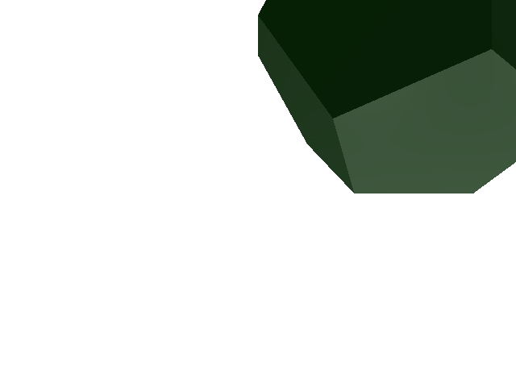
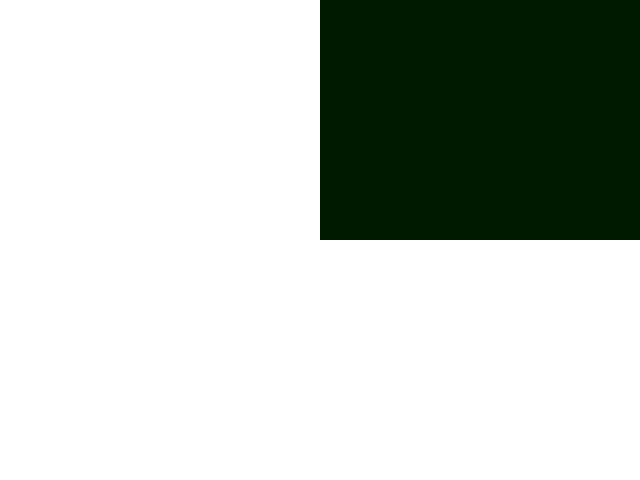
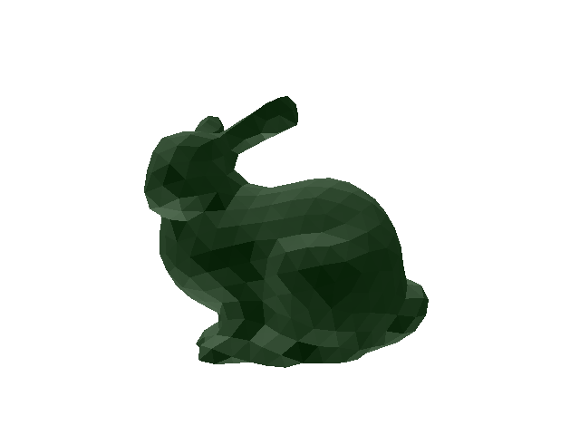
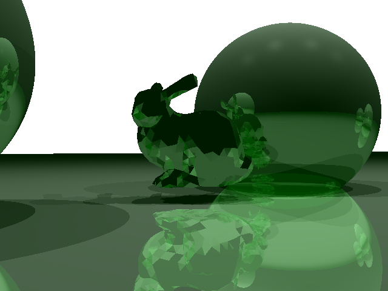

# Ray Tracing: Triangle Meshes and AABB Trees
The goal of this assignment is to implement ray tracing for a triangle mesh, and implement acceleration structures to make the computation faster.

## Using Eigen
In all exercises you will need to do operations with vectors and matrices. To simplify the code, you will use Eigen. Have a look at the Getting Started page of Eigen as well as the Quick Reference page for a reference of the basic matrix operations supported.

## Preparing the Environment
Follow instructions the general rules to setup what you need for the assignment.

## Ex .1
* Implemented `find_nearest_object`, `ray_triangle_intersection`
* Updated `raytrace_scene`

## Ex. 2
*Please note: I spent 2 days straight trying to get this code to work and spent hours looking at pseudocode and trying to debug my issues. The code was not working, so I had to comment out the section that calls these functions.*

* Implemented `AABBTree`:
  * split input into two sets (s1 & s2)
  * created a vector array to keep track of indices
  * sorted both lists individually after sorting the centroids (implemented `sort_rows` and `compare_head`)
  * recursively called `build_tree_rec` on each subtree
  * set both roots to have their parent as the tree root
* Created a new function (`build_tree_rec`) which recursively calls itself to build the AABB Tree:
  * checks base case (if there are 2 or fewer items in the array) & returns accordingly
  * creates a temporary box which extends the barycentric coordinates of all remaining items in the array (implemented `get_barycentric`)
  * finds the maximum axis to compare against (implemented `compare_bary`)
  * creates a new parent node for the children you are about to compare
  * makes a temporary variable to keep track of the middle of the list
  * splits the list of remaining indices in two
  * recursivelly calls itself with the first half of the array (left) and the second half of the array (right)
  * sets new values for the parent node
* Did not finish implementation of:
  * `tree_traversal`: would return a list of the leaf nodes that intersected with the ray (so you would only need to call `ray_triangle_intersection`)
  * method 2 in `find_nearest_object` - this is what would have called `tree_traversal`

## Bonus Work
### Bonus 1
* Added code to include spheres/parallelograms. 
* Code taken from A3.

### Bonus 2
* Added code to include shadows. 
* Code taken from A3.

### Bonus 3
* Added code to include reflections. 
* Code taken from A3.

