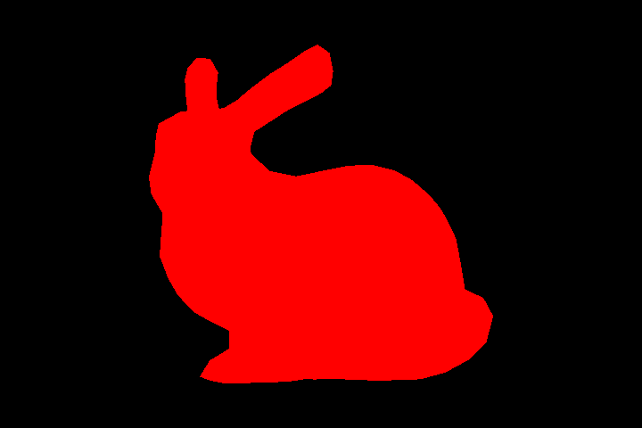
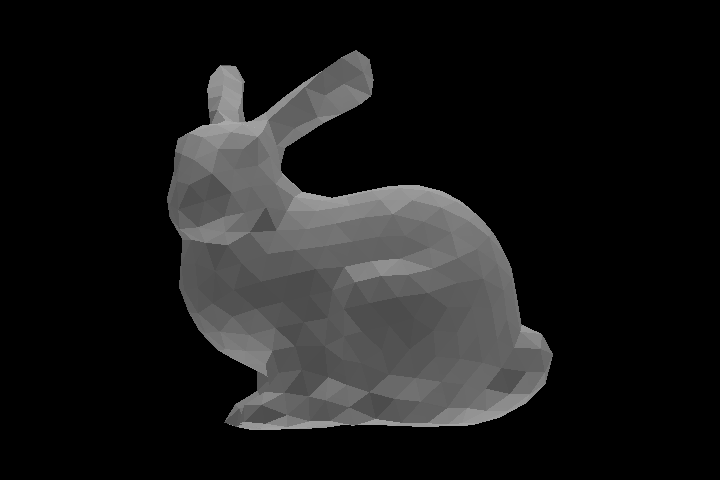
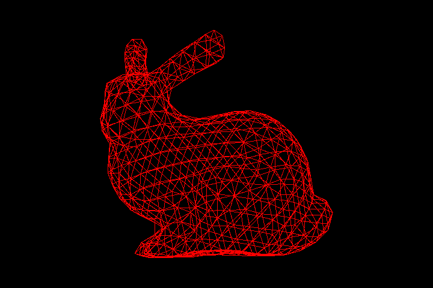
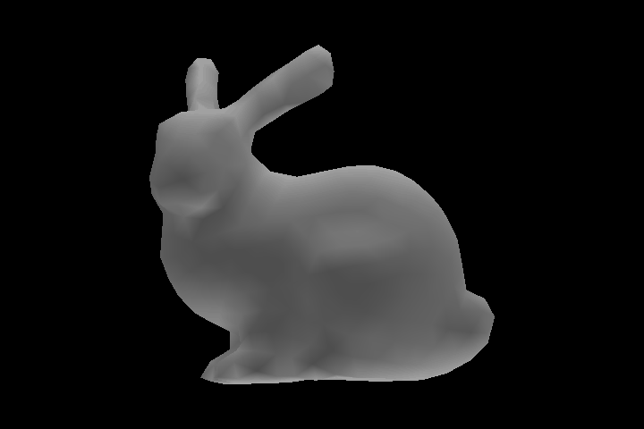
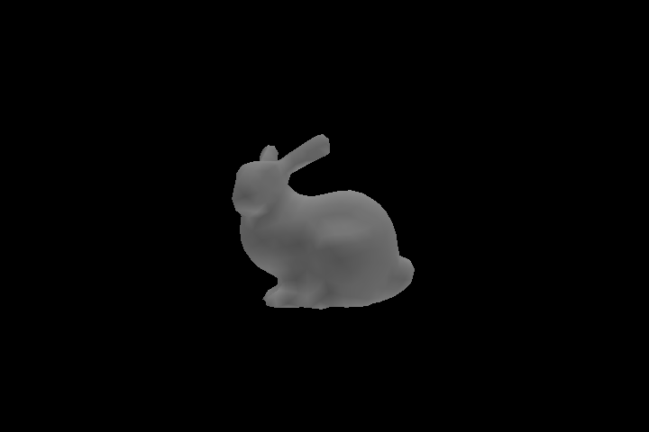

## Overview

Implement a rendering system for triangulated 3D models based on rasterization.

### Preparing the Environment

Follow the instructions on the [general instructions page](../../RULES.md) to set up what you need for the assignment.

## Ex.1: Load and Render a 3D model

1. Build the camera tranformation matrix
2. Build the Orthographic Projection matrix, see Assignment 3 for computing t and l.
3. Fill the shaders to rasterize the bunny in red

This is the output

## Ex.2: Wireframe

Render the bunny using a wireframe; only the edges of the triangles are drawn.

This is the output

## Ex.3: Shading

In this exercise, I implement two different shading options for the triangles: flat shading, and per vertex shading.

In **Flat Shading** each triangle is rendered using a unique normal (i.e. the normal of all the fragments that compose a triangle is simply the normal of the plane that contains it).

In **Per-Vertex Shading** the normals are specified on the vertices of the mesh, the color is computed for each vertex, and then interpolated in the interior of the triangle.

1. Implement the light equation
2. Implement the depth check
3. Compute the per face normals and render the bunny with flat shading
4. Compute the per vertex normals and render the bunny with vertex shading

This is the output for flat shading

This is the output for vertex shading

## Ex.4: Object Transformation

Add an option to rotate the object around the y-axis centered on its barycenter.

This is the animation for wireframe shading

This is the animation for flat shading

This is the animation for per vertex shading

## Ex.5: Camera

Implement a *perspective camera*.

This is the output for flat shading and perspective camera

This is the output for vertex shading and perspective camera

